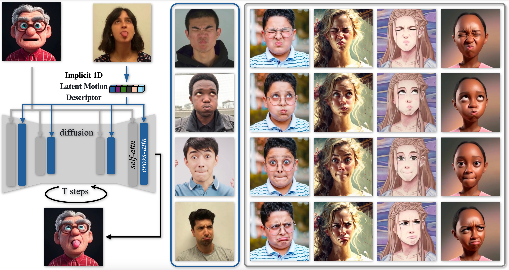

<!-- # magic-edit.github.io -->

<p align="center">

  <h2 align="center">X-NeMo: Expressive Neural Motion Reenactment via Disentangled Latent Attention</h2>
  <p align="center">
                <a href="https://xiaochen-zhao.netlify.app/">Xiaochen Zhao</a>,
                <a href="https://hongyixu37.github.io/homepage/">Hongyi Xu</a>,
                <a href="https://guoxiansong.github.io/homepage/index.html">Guoxian Song</a>,
                <a href="https://scholar.google.com/citations?user=FV0eXhQAAAAJ&hl=en">You Xie</a>,
                <a href="https://zhangchenxu528.github.io/">Chenxu Zhang</a>,
                <a href="https://lixiulive.com/">Xiu Li</a>,
                <a href="http://linjieluo.com/">Linjie Luo</a>,
                <a href="https://scholar.google.com/citations?user=e4lel8QAAAAJ&hl=zh-CN">Jinli Suo</a>,
                <a href="http://www.liuyebin.com/">Yebin Liu</a>
    <!-- <br>
        <a href="https://arxiv.org/abs/2403.15931"></a>
        <a href='https://byteaigc.github.io/x-portrait/'></a>
        <a href='https://youtu.be/VGxt5XghRdw'>
        </a>
    <br> -->
  </p>
  
  <table align="center">
    <tr>
    <td>
      
    </td>
    </tr>
  </table>
</p>

This repository contains the video generation code of ICLR 2025 paper [X-NeMo](https://openreview.net/pdf?id=ML8FH4s5Ts) and the project [X-Portrait2](https://byteaigc.github.io/X-Portrait2/).

[**Arxiv Paper**](https://openreview.net/pdf?id=ML8FH4s5Ts) | [**Project Page**](https://byteaigc.github.io/X-Portrait2/)

## Installation
```shell
# Python 3.9, CUDA 12.2
conda create -n xnemo python=3.9
conda activate xnemo
pip install -r requirements.txt
```

## Model
Please download Stable Diffusion 1.5 pre-trained model ([i2v-xt](https://huggingface.co/stabilityai/stable-video-diffusion-img2vid-xt) and [img-variations](https://huggingface.co/lambdalabs/sd-image-variations-diffusers)), and save it under "pretrained_weights/".

Please download X-NeMo pre-trained model from [here](https://drive.google.com/drive/folders/1RdjBYYbstO7SOchDg7oimoAwu03g_-mI?usp=sharing), and save it under "pretrained_weights/".

## Testing
```shell
bash eval.sh
```

## License
The use of the released code and model must strictly adhere to the respective licenses. Our code is released under the Apache License 2.0, and our model is released under the [Creative Commons Attribution-NonCommercial 4.0 International Public License](https://huggingface.co/ByteDance/InfiniteYou/blob/main/LICENSE) for academic research purposes only. 

This research aims to positively impact the field of Generative AI. Any usage of this method must be responsible and comply with local laws. The developers do not assume any responsibility for any potential misuse.

## 🎓 Citation
If you find this codebase useful for your research, please use the following entry.
```BibTeX
@inproceedings{
zhao2025xnemo,
title={X-NeMo: Expressive Neural Motion Reenactment via Disentangled Latent Attention},
author={XIAOCHEN ZHAO and Hongyi Xu and Guoxian Song and You Xie and Chenxu Zhang and Xiu Li and Linjie Luo and Jinli Suo and Yebin Liu},
booktitle={The Thirteenth International Conference on Learning Representations},
year={2025},
url={https://openreview.net/forum?id=ML8FH4s5Ts}
}
```